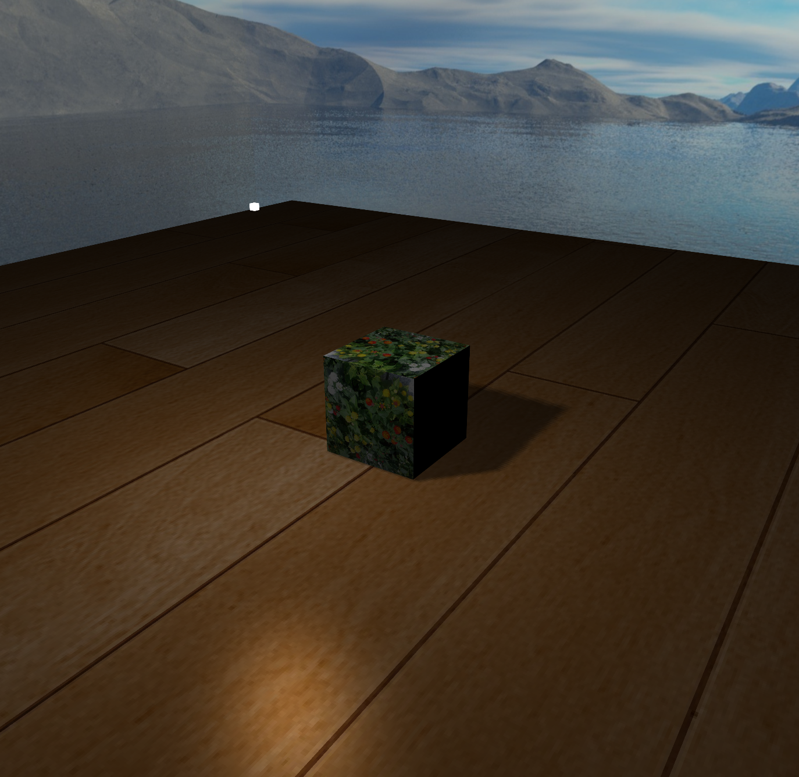
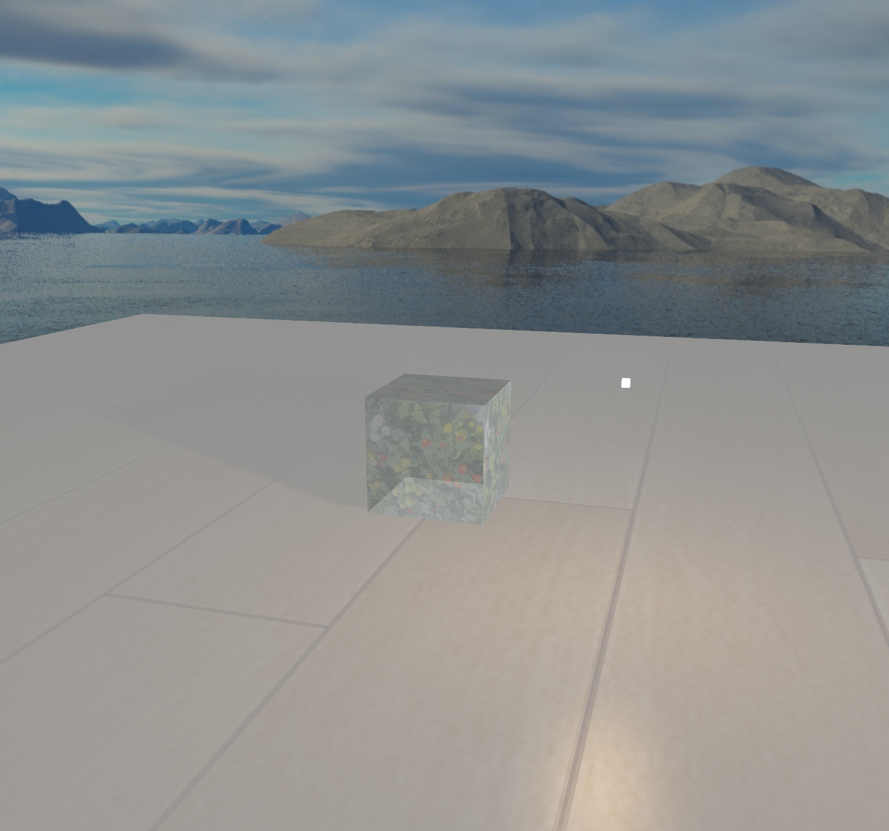

# 编程作业3，介绍

## 基本任务

### 打开方式

-访问网址 http://www.cgworkliudongxv.com/

### 目录结构

- 底层库：phongshading-todo//Common
- 渲染器：phongshading-todo//shaders
- 背景图片：phongshading-todo//skybox
- 物体和地板图片：phongshading-todo//container.png和wood.png
- 执行代码：
phongshading-todo//Phoneshading.js (负责gl初始化，点击事件和主操作流)
phongshading-todo//Model.js (方体和平面模型生成方法)
phongshading-todo//configTexture.js (背景立方体和中心物体立方体的纹理创建方法)
phongshading-todo//configMaterialParameter (传递材质参数到shader)

### 简介

依次完成了TODO1,TODO2,TODO3，实现的具体原理在实验报告中（报告.docx）。
项目因此能够将图片作为纹理渲染到物体上，并且实现了光照和阴影的处理，

## 额外任务

完成中心展示物体的半透明工作，具体如下

### 启用颜色混合

在Phoneshading.js的初始化界面，写入
//TODO-4-启动
gl.enable(gl.BLEND);
gl.blendFunc(gl.SRC_ALPHA, gl.ONE_MINUS_SRC_ALPHA);
开启WebGL颜色混合功能，并设置混合因子

### 透明操作

phongshading-todo//shaders//box.frag的片元渲染器里，将main()方法的最后一行的返回值修改为：
FragColor = vec4(resultColor, 0.5f);
即将不透明度设置为0.5

### 补充

本代码并没有实现透过能看到后方背景的透明（咨询老师说已经满足要求了要实现到这个程度过于复杂  QAQQQAQ       ）
效果图如下

## 其他